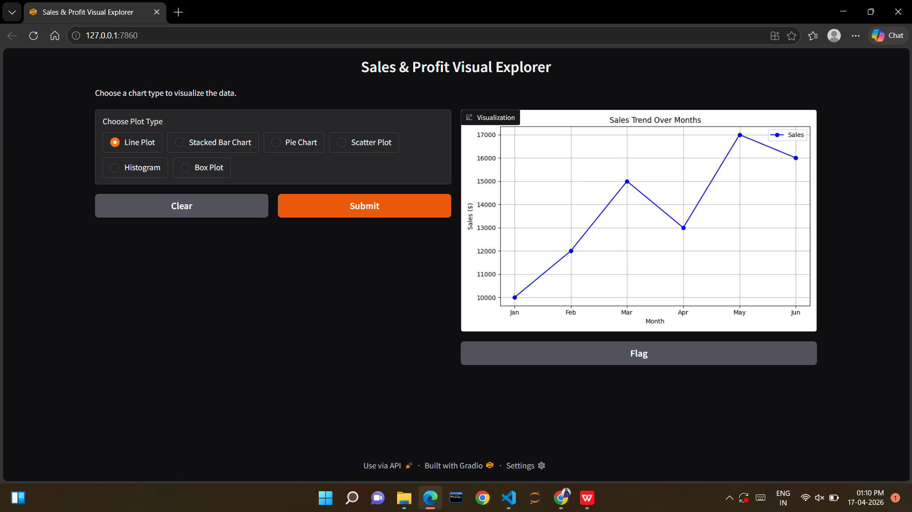
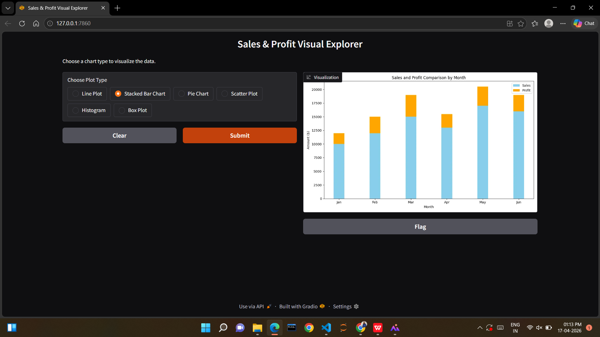
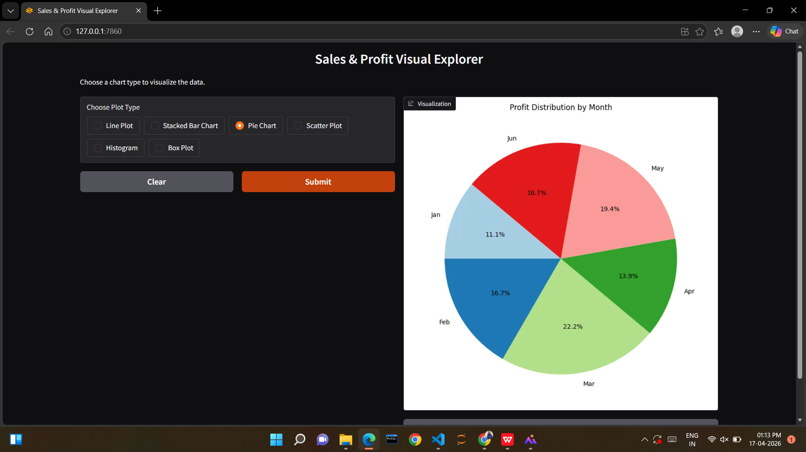
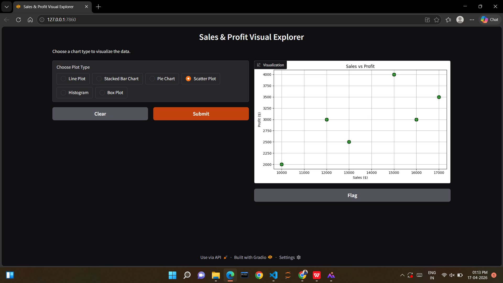
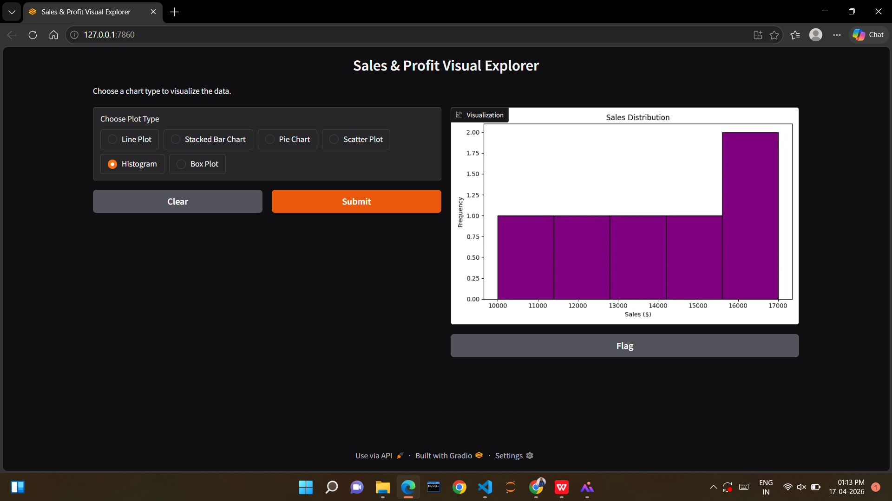
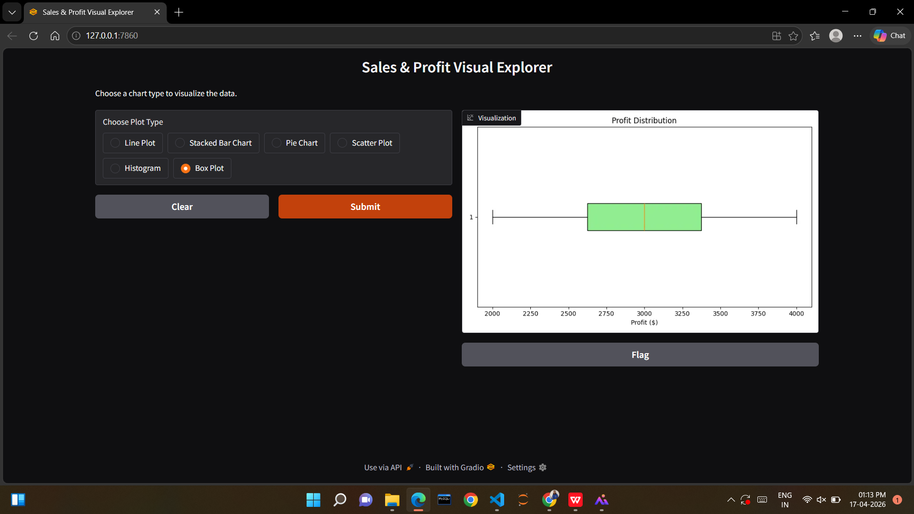

# Sales & Profit Visual Explorer

An interactive data visualization project built using Gradio, Pandas, and Matplotlib.

## Features
- Line Plot
- Stacked Bar Chart
- Pie Chart
- Scatter Plot
- Histogram
- Box Plot

## Technologies Used
- Python
- Gradio
- Pandas
- Matplotlib

## How to Run

Install dependencies:
pip install -r requirements.txt

Run the application:
python gradio_app.py

## Application Screenshots

### Line Plot

### Stacked Bar Chart

### Pie Chart

### Scatter Plot

### Histogram

### Box Plot

## Project File
- gradio_app.py → Main application file

## Author
Created for learning interactive data visualization using Python.
